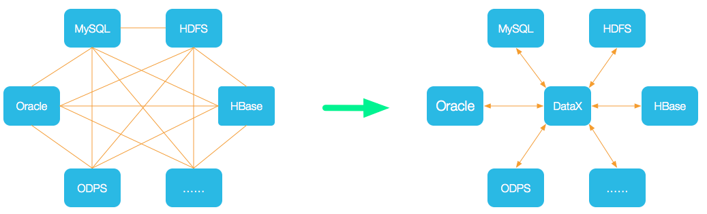

# Introduction
## 背景
主要考量现有的两种开源导数工具——Sqoop、DataX。  
#### Sqoop  
[Sqoop](https://sqoop.apache.org/docs/1.4.7/SqoopUserGuide.html)是到目前为止(2020.05)一直在使用的离线导数工具，主要负责RDBMS到HDFS文件之间的双向通路。  
优点:  
1. 多年开源积累，在其支持的导数姿势下，功能全面。
2. 使用MapReduce进行导数，避免单机瓶颈，且可以利用yarn做任务管理、资源调度。

缺点:  
1. 代码架构虽然清晰但是结构混乱，模块间逻辑及功能界线极其模糊不定。
2. 数据源导数策略与RDBMS端强耦合，schema信息完全由单侧提供。换句话说，import(RDBMS->HDFS)与export(HDFS->RDBMS)完全是两套策略，只是共用基本架构而已。
3. 代码冗杂，肉眼可见的历史包袱。

总体而言，Sqoop的优点在于对MR框架的利用，但是在其之上的二次开发需要面对极大且不必要的开发成本。而在其之上增加异构数据源的支持由于原生架构与RDBMS的强耦合，横向扩展性极低，势必处处挚肘，开发成本过高。  
#### DataX
[DataX](https://github.com/alibaba/DataX/blob/master/introduction.md)是阿里开源的多数据源导数工具，虽未使用但是功能强大。  
优点:  
1. 设计思想优秀，采用交换机的思想规范化不同数据源的数据类型，数据源自身提供与交换机的IO姿势后，便可继承到DataX支持的数据源大家族中，横向扩展性非常高。

2. 支持某些基本类型转换，允许上下游列类型不同。
2. 已支持逾10种数据源的IO，代码资源丰富。

缺点:  
1. 开源版本仅有单机多线程的实现，会有单机瓶颈。
2. 支持的数据类型受限，尤其不支持嵌套类型。
3. 不支持列名映射等列名相关feature，且列名、列类型的获取姿势仅能通过用户定义，过于保守。

DataX的异构数据源解耦的设计思想非常优秀，但是在工具本身的功能(Sqoop同样)以及任务调度的模式上仍有不符合需求之处。
## 概览
Hercules的目标在于采Sqoop、DataX两者之长——使用MR作为多任务调度模型的基础上，使用DataX的交换机思想，实现一个高解耦、易扩展的功能健全的导数工具。  
目前支持的可导数的数据源类型:  

|数据源|可读|可写|
|:---:|:---:|:---:|
|Mysql|[✓](./use/Mysql.md#source)|[✓](./use/Mysql.md#target)|
|TiDB|[✓](./use/TiDB.md#source)|[✓](./use/TiDB.md#target)|
|Clickhouse|[✓](./use/Clickhouse.md#source)|[✓](./use/Clickhouse.md#target)|
|Generic JDBC|[✓](./use/RDBMS.md#source)|[✓](./use/RDBMS.md#target)|
|MongoDB|[✓](./use/MongoDB.md#source)|[✓](./use/MongoDB.md#target)|
|Parquet|[✓](./use/Parquet.md#source)|[✓](./use/Parquet.md#target)|
|Parquet Schema|✗|[✓](./use/ParquetSchema.md#target)|

## 优势
+ 利用MR，极大隐去单机瓶颈，并可以利用yarn做任务调度及资源管理之用。(Sqoop优势)
+ 交换机模式提供了复杂度为O(2n)的解决方案，而非O(n²)。 (DataX优势)
+ 数据源间强解耦能够有效避免一颗老鼠屎坏了一锅汤，不会像Sqoop一样背着过重的涉及到整体结构的历史包袱。 (DataX优势)
+ 基本数据类型之间提供一定的[转换能力](./dev/Core.md#wrapper)，能够适应上下游数据类型不一致的情况。 (DataX优势，但提供更多的数据类型，能够提供更高的精度，避免不够用导致数据源自己定义自己的数据类型，架空Hercules的逻辑/绕过Hercules的约束)
+ 支持Map与List数据类型，并允许利用列名映射的方式做嵌套与嵌套展开。
+ 支持数据源schema的高灵活获取策略，结合*用户配置*、*数据源读取*以及*对侧数据源提供*的方式，兼具灵活性与方便性。
+ 还在想...

## 使用
请移步[使用文档](./use/QuickStart.md)。
## 开发
请移步[开发文档](./dev/General.md)。