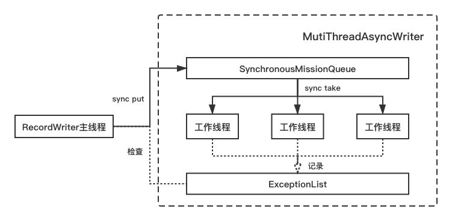

# 核心组件
对一些值得描述/较为重要的组件仔细讲一下。较为粗糙的总体性的描述可以参考[此处](./General.md#模块划分)。
## 参数解析/存储
### SingleOptionConf
定义单个用户对象，使用建造者模式构建。每个用户参数具有以下属性:  
+ 名字 (必填)
+ 是否需要值 (必填)
+ 是否必填 (默认`false`)
+ 默认值 (选填)
+ 描述 (必填)
+ 是否为列表型参数 (默认为`false`)
+ 为列表参数时的分隔符 (默认为`,`)

### OptionsConf
负责定义、使用SingleOptionConf注册、校验、二次加工用户参数。  
由于不可避免地会遇到参数多继承问题，此类严格使用组合模式，每个子类定义一个祖先列表，不可使用继承，一切参数的定义均通过组合方式而非继承。  
不允许实现类之间继承的原因在于，组合后参数的处理逻辑全权由基类BaseOptionsConf进行处理，若引入继承方式的参数定义，处理逻辑会揉杂组合与继承方式，尤其是多层揉杂后，逻辑关系会变得极其混乱，后期极难维护，且极大幅加大事前校验难度。  
在程序启动时(`TODO` 可以移到单元测试环节进行，此环节为检查类依赖关系，只需编译时运行一次即可，无需运行时检查)会对当前所有OptionsConf进行检查:  
1. 是否所有OptionsConf都继承自BaseOptionsConf。
2. 是否组合关系之间存在循环引用，即组合关系应当为一张有向无环图，如不遵守会导致无限递归导致爆栈。  

组合后，定义、注册、校验、二次加工规则如下:  
+ 定义参数是以静态公共变量的方式进行定义，与继承无关，不表。
+ 注册参数将注册本类以及所有祖先类的参数，直到遍历完整张组合图。  
若本类与祖先类出现同名参数，将以本类注册的参数信息为最优先；若祖先类之间出现同名参数，将以祖先列表中靠后的祖先注册的参数信息为准。  
同时提供方法在移除祖先定义的参数。
+ 校验参数会优先进行祖先的校验逻辑，而后进行本类的校验逻辑。(`TODO` 若同名参数出现后代与祖先校验规则不一致，有可能出现被祖先误杀的情景，不甚合理，但还没想好怎么优化)
+ 二次加工参数会优先进行祖先的校验逻辑，而后进行本类的校验逻辑。

### Parser
负责参数的解析行为，与OptionsConf解耦，内部维护一OptionsConf实例，用于提供参数信息、校验参数及二次加工参数。内部流程如下:  

本例中展示的流程主要针对命令方式输入的用户参数，使用的解析包为[Apache Commons CLI](http://commons.apache.org/proper/commons-cli/)。若需要适配更多的命令参数输入源，还是需要对类结构做一定改造的，但是幅度应该不会太大。  
### GenericOptions
上述数据源Parser parse后的产物，直接存储用户参数的介质，内部以一张HashMap<String, String>的方式存储，并提供多类型读/写的接口。  
提供与Configuration之间转换的方法，一般由WrappingOptions调用。
通过内置方法，支持直接读出的类型包括: `Integer`、`Long`、`Double`、`BigDecimal`、`Boolean`、`String`、`String[]`。  
同时支持两种写类型: `Obejct`、`String[]`。
其中，有两点记录一笔:  
+ 由于支持存储字符串Array，GenericOptions内部使用`@%HHXHH%@`作为分隔符。
+ 由于空字符串值在转换为Configuration后会被过滤，导致下游读出后此参数消失，而事实上空值与无此参数是有区别的，故使用`@%HHX_HERCULES_EMPTY_PLACEHOLDER_XHH%@`作为空值占位符。

### WrappingOptions
GenericOptions的封装类，内部存储三个GenericOptions，方便传参调用。并能够调用GenericOptions与Configuration之间转换方法进行整体转换。

## Schema
### DataType
Hercules内部数据类型枚举值，由于系统模型为星型结构，除了需要定义各数据类型的[中间存储介质](./Core.md#wrapper)外，还需定义内部类型以标准化导入导出流程，并且使得上述双侧数据源互相参考schema信息的feature成为可能。  
其中，负责将数据源自身类型转换为Hercules内部类型的类是[DataTypeConvert](./General.md#datatypeconvert)。  
总共定义17种Hercules内部基本类型，并包括`LIST`和`MAP`两种集合类型，能够覆盖绝大多数数据源类型，方便转换:  
+ NULL
+ BYTE
+ SHORT
+ INTEGER
+ LONG
+ LONGLONG
+ BOOLEAN
+ FLOAT
+ DOUBLE
+ DECIMAL
+ STRING
+ DATE
+ TIME
+ DATETIME
+ BYTES
+ LIST
+ MAP

### SchemaNegotiator
全局唯一，策略模式Context对象，采用源/目标SchemaFetcher作为策略对象。内部流程如下:  

  

(其中划为三条泳道的目的是为了使流程图对角色表述更为清晰，而非表示三条之间的逻辑是以并行的方式运行。)  

数据源列名列表的获得逻辑可简单概括为:  
1. 用户定义
2. 若用户定义为空，从数据源内取
3. 若仍然为空，且另一侧不为空，在用户指定允许的前提下，超对侧数据源经列名映射后的列名列表 (相关参数: `allow-copy-column-name`)

数据源列类型映射的获得逻辑可简单概括为:  
1. 用户定义
2. 从数据源内取
3. 合并上述两结果，若有冲突以用户定义为准
4. 若用户指定允许参考对侧数据类型，再根据列名映射，填充现有列类型映射，若有冲突以本侧结果为准 (相关参数: `allow-copy-column-type`)

概括而言，SchemaNegotiator会试图从三个方向尽可能完善schema信息，其获取顺序及优先度为: 用户定义 > 数据源提供 > 对侧数据源提供。这样的设计比起强制用户指定列名及列类型(DataX)或直接从数据源获取(Sqoop)兼具了灵活性与便利性。  

除此之外，若两侧数据源至少都能在数据源侧获取列名信息时，Hercules会做额外的检查:  
1. 上游列是否多于下游列
2. 下游列是否多余上游列

当不做任何配置时，一旦出现上述两种情况任一，会抛出错误，旨在使得Hercules能够对数据源schema变动有感知，提前预防可能发生的缺列错误。  
上述两个检测行为可分别通过`allow-source-more-column`和`allow-target-more-column`两个参数关闭。  
另外，当关闭检测后，多列少列时的具体行为是:  
1. 上游多列时: 本列被无视，不会同步到下游。
2. 下游多列时: 若为RDBMS，该列使用默认值 (而非置null)；若为其他，该列不被插入。

## MapReduce
### Wrapper
存储实际数据的对象，存储粒度为列。  
基类为BaseWrapper。  
Wrapper作为中间**存储**介质的同时，也兼备**字节大小估算**及**基本类型转换**的能力。共有9种Wrapper实现，其基本信息和与DataType的对应关系如下:  

|Wrapper|用于存储|内部存储类型|DataType|
|:---:|:---:|:---:|:---:|
|IntegerWrapper|整数|BigInteger|BYTE|
| | | |SHORT|
| | | |INTEGER|
| | | |LONG|
| | | |LONGLONG|
|DoubleWrapper|浮点数|BigDecimal|FLOAT|
| | | |DOUBLE|
| | | |DECIMAL|
|BooleanWrapper|布尔值|Boolean|BOOLEAN|
|StringWrapper|字符串|String|STRING|
|DateWrapper|日期|String|DATE|
| | | |TIME|
| | | |DATETIME|
|BytesWrapper|字节数组|byte[]|BYTES|
|ListWrapper|列表|List<BaseWrapper>|LIST|
|MapWrapper|Map|Map<String, BaseWrapper>|MAP|
|NullWrapper|null|String|NULL|

另外，由此类能够胜任的基本数据类型转换的支持情况如下:  

|Wrapper\基本Java类型|Long|Double|BigInteger|BigDecimal|Boolean|Date|String|byte[]|JSON|
|:---:|:---:|:---:|:---:|:---:|:---:|:---:|:---:|:---:|:---:|
|**IntegerWrapper**|✓|✓|✓|✓|✓|✓|✓|✓|✗|
|**DoubleWrapper**|✓|✓|✓|✓|✓|✓|✓|✓|✗|
|**BooleanWrapper**|✓|✓|✓|✓|✓|✗|✓|✓|✗|
|**StringWrapper**|✓|✓|✓|✓|✓|✓|✓|✓|✓|
|**DateWrapper**|✓|✓|✓|✓|✗|✓|✓|✓|✗|
|**BytesWrapper**|✗|✗|✗|✗|✗|✗|✓|✓|✓|
|**ListWrapper**|✗|✗|✗|✗|✗|✗|✓|✗|✓|
|**MapWrapper**|✗|✗|✗|✗|✗|✗|✓|✗|✓|
|**NullWrapper**|✓|✓|✓|✓|✓|✓|✓|✓|✓|

### HerculesWritable
Wrapper的包装类，存储粒度为行，作为RecordReader与RecordWriter的KEY值使用。内部使用`MapWrapper`存储，支持嵌套结构的存储。  
### WrapperGetter + WrapperGetterFactory
两个类的设计采用了函数式编程的思想，各个数据源需要实现与Wrapper类型一一对应的读取行为。
#### WrapperGetter
接口。对于每种数据源，各个Wrapper类型应当有对应实现，负责将数据源读取时负责存储的数据类型(如ResultSet)列->列地生成对应类型的Wrapper。  
#### WrapperGetterFactory
抽象类。各个数据源在其子类中负责实现各类型WrapperGetter的匿名实现类，通过父类模版构建<DataType-WrapperGetter匿名类>的哈希表，在外部通过DataType调用时直接返回对应方法。若数据源不支持某种数据源，会抛错。  
### WrapperSetter + WrapperSetterFactory
两个类的设计采用了函数式编程的思想，各个数据源需要实现与Wrapper类型一一对应的写入行为。
#### WrapperSetter
接口。对于每种数据源，各个Wrapper类型应当有对应实现，负责将Wrapper的值根据下游类型列->列地写入数据源写入时负责存储的数据类型(如PreparedStatement)。  
#### WrapperSetterFactory
抽象类。各个数据源在其子类中负责实现各类型WrapperSetter的匿名实现类，通过父类模版构建<DataType-WrapperSetter匿名类>的哈希表，在外部通过DataType调用时直接返回对应方法。若数据源不支持某种数据源，会抛错。  
### HerculesRecordWriter
使用[Guava RateLimiter](https://guava.dev/releases/19.0/api/docs/index.html?com/google/common/util/concurrent/RateLimiter.html)进行写QPS的限制。  
若子类实现为batch方式写，在调整qps时，需同时考虑batch的影响，这将仅影响塞batch缓存的速度。
### MultiThreadAsyncWriter
抽象类，父类定义了一个多线程写数据眼的模版，子类主要负责实现初始化、写数据源、资源释放，旨在大幅简化多线程写的编码复杂度。
类内模型如下图:  

工作线程由一个`FixedThreadPool`根据构造函数内传入的线程数构建。  
工作线程内为一个无限循环，每次循环从BlockingQueue阻塞地take到任务后执行写操作。  
当外部调用`done()`方法时，类会向BlockingQueue送达n(n=工作线程数)个`close=true`的消息，每个线程拿到此消息后break出循环，此机制能保证不会有线程永远拿不到或多拿结束信号。当ThreadPool等待所有线程结束后，退出`done()`方法。  
当某工作线程在写时(无限循环内)遇到Exception，此时模型并不会即刻跳出循环并抛出，而是会将错误记录于**ExceptionList**中，而这条列表在每次put任务以及关闭writer后都会进行非空检查，一旦发现有错误发生，先进行上述关闭流程，再抛出列表内第一条错误。相比直接跳出循环抛错，这种方式更为安全和优雅。  

采用异步多线程写的优点有如下几条:  
+ 一般而言，写操作的时间开销大于读操作，多线程写能够更高得利用系统资源，加快速度。
+ 通过异步模型，将*写*与*读+转换*尽可能并行化，提高效率，同时利用SynchronousQueue控制缓存大小。

同时，异步写也有着一定的缺点:  
+ 增加系统复杂性
+ 将*提交写任务*与*实际写行为*异步后，做错误控制的代价将更高。(翻译一下: 如果我想在RecordWriter中`write()`遇到Exception时无视，继续下一次写，这个行为在这个模型下将会变得更为复杂，因为在Writer里的`catch`到的错误已经是二手货了，AsyncWriter自己早就关干净了，所以如果要达到这个目的，必然要对此模型再加以改造，其实和第一个问题一样，还是会造成系统的复杂性)

另外，本模型也提供了两个计时器，分别记录阻塞put和各线程阻塞take的耗时，便于调整工作线程数以优化性能。  