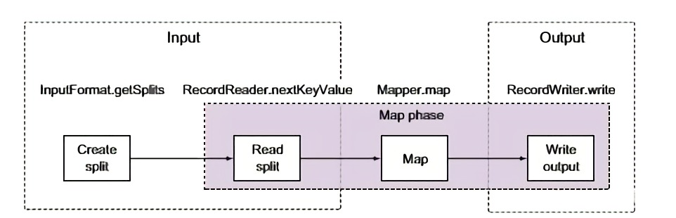
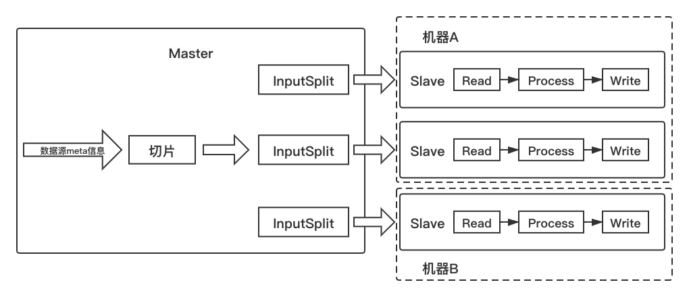
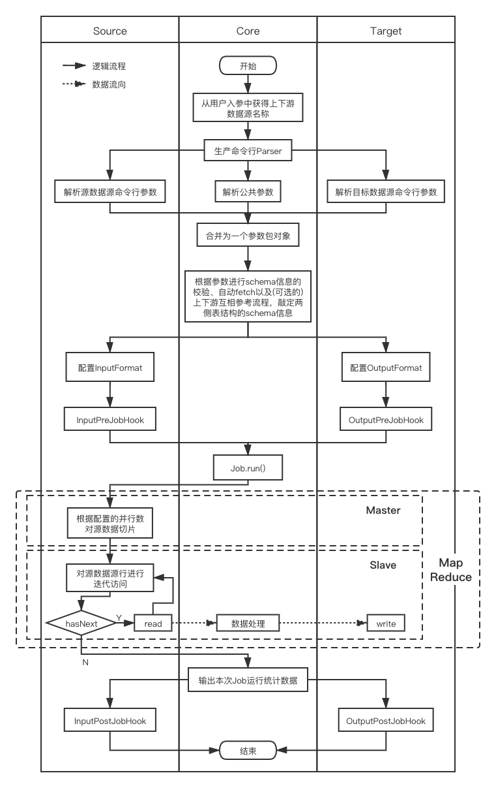
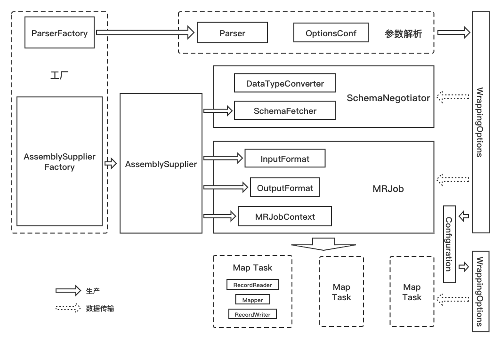
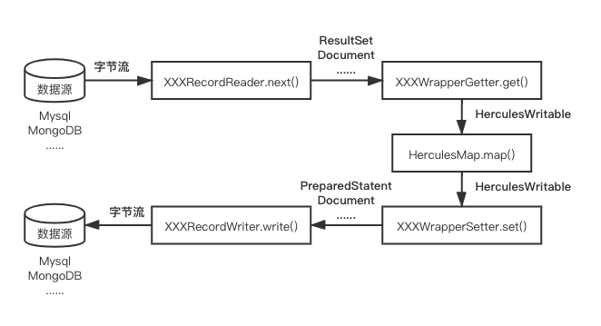

# 总览
## 打包
根目录下执行`mvn clean package`，可执行jar包位于`./target/`。  
## 工作原理
核心指导思想是利用MapReduce中的Map操作进行数据的切片-读取-处理-写入。在这个逻辑上与Sqoop保持一致。  
上述流程实际是借助MapReduce框架的InputFormat、RecordReader、Mapper、OutputFormat以及RecordWriter共同完成的。  
如下图:  

## 核心架构
从执行实例/机器的角度来看如下图:  

1. 在运行Hercules的主机器内根据源数据源的meta信息，执行由源数据源提供的切片方法，返回切片列表。切片内存储数据源在实际读时需要知道的具体切分信息。
2. 由MR任务调度启动对应数量的slave实例并将切片序列化传输至其上。
3. Slave实例循环执行源数据源的对应迭代读操作-数据转换行为-目标数据源写操作。 
 
其中，遵循yarn的分配规则，slave实例有可能共用一台机器，并非一个slave独享一台机器。
## 总体流程

  

(其中划为三条泳道的目的是为了使流程图对角色表述更为清晰，而非表示三条之间的逻辑是以并行的方式运行。)  
## 模块划分
根据上述总体流程，有如下对应的模块划分设计:  

  

### OptionsConf
每个数据源存在两个实例，分别负责定义数据源作为源/目标时所需要的用户参数名，并进行、检查以及二次加工。  
### Parser
每个数据源存在两个实例，此类为模版模式类，基类负责进行命令行参数的解析；数据源两个子类负责给出数据源作为源/目标时对应的OptionsConf实例。Parser与OptionsConf分离的目的在于用户参数的解析与用户参数的定义之间的解耦，可借助ParserFactory作为抽象工厂以适应未来更多的用户参数输入形式(如RestAPI)。  
### WrappingOptions
Hercules参数存储对象，内部分别存储源数据源、目标数据源与公共参数三个对象。提供与[Configuration](./General.md#configuration)之间的转换方法，大幅自动化Hercules与MR Job之间两个配置体系间的传参过程。
### AssemblySupplier
每个数据源存在一个实例，提供[SchemaNegotiator](./General.md#schemanegotiator)以及[MRJob](./General.md#mrjob)两个策略模式Context对象的具体策略对象——SchemaFetcher、InputFormat(Class)、OutputFormat(Class)以及分别作为源/目标时的MRJobContext。  
这个类的存在意义可能比较难以表述，打个比方，以汽车为例，一辆车(策略模式Context对象)走动需要发动机、变速箱等(策略对象)等共同协作，而现在的场景是需要这些零件有一个共同的生产商(如福特的车就用福特的发动机、变速箱)，而AssemblySupplier类便扮演了"生产商"这个角色，数据源类型对应"品牌"概念，而AssemblySupplierFactory就根据不同的"品牌"提供不同的"生产商"，此外，一些"子品牌"(子数据源类型，如Mysql之于RDBMS)需要提供不同的零件也可通过继承来实现。  
自然，各个策略对象可以构建各自的工厂去生产，但是在Hercules场景下，数据源内部的策略需要的是高内聚，而工厂带来的解耦性与额外的结构复杂度是完全不必要的。  
### DataTypeConvert
每个数据源存在一个实例，负责将数据源提供的列类型映射为Hercules提供的类型，提供列->列，行->行两种映射粒度接口。  
### SchemaFetcher
每个数据源存在一个实例，负责从数据源捞取schema信息，包括列名列表与<列名-列Hercules类型>映射。与DataTypeConvert搭配使用，拆分的目的在于将获取schema的逻辑与转换为内部类型的逻辑解耦。 
### SchemaNegotiator
核心组件，策略模式Context对象，执行两侧数据源schema信息的校验、自动fetch以及(可选的)上下游互相参考流程，敲定两侧表结构的schema信息。在此之后两侧schema原则上不会被更改了，仅有读操作。  
### Configuration
[MapReduce参数存储对象](https://hadoop.apache.org/docs/current/api/org/apache/hadoop/conf/Configuration.html)，作为主进程与Map进程之间参数传递的介质。
### InputFormat
[MapReduce接口](https://hadoop.apache.org/docs/stable/api/org/apache/hadoop/mapred/InputFormat.html)，数据源进行实现。
### OutputFormat
[MapReduce接口](https://hadoop.apache.org/docs/stable/api/org/apache/hadoop/mapred/OutputFormat.html)，数据源进行实现。  
### MRJobContext
每个数据源存在两个实例，负责分别对InputFormat/OutputFormat进行配置(虽然借助WrappingOptions与Configuration之间的转换能力避免了Hercules本身参数的配置工作，但是在map task读写采用代理模式时，依然有存在的价值)、定义pre MR job钩子函数以及post MR job钩子函数。  
### MRJob
核心组件，策略模式Context对象，执行配置MR job的InputFormat、OutPutFormat以及Mapper类对象，并执行两侧数据源提供的MRJobContext内部钩子函数。在MR job执行完成后负责输出用时、传输速度等统计信息。若在map阶段出现错误，本类会试图从map日志中收集对应信息打在主进程的日志里，方便确认问题。  
### RecordReader
[MapReduce接口](https://hadoop.apache.org/docs/stable/api/org/apache/hadoop/mapred/RecordReader.html)，数据源进行实现。  
### RecordWriter
[MapReduce接口](https://hadoop.apache.org/docs/stable/api/org/apache/hadoop/mapred/RecordWriter.html)，数据源进行实现。  
### Mapper
[MapReduce接口](https://hadoop.apache.org/docs/stable/api/org/apache/hadoop/mapred/Mapper.html)，Hercules定义唯一实现类，类内负责对RecordReader读出的Hercules结构数据根据用户参数进行一定的处理变换并传到RecordWriter。  

更多细节请移步[此处](./Core.md)。
## 数据流

  

其中，Hercules内部通过[HerculesWritable](./Core.md#herculeswritable)来进行数据的规范化与传输。  
流程详细描述如下:  
1. RecordReader从源数据源逐行读取数据，并打包成对应数据类型，如JDBC-ResultSet、MongoDB-Document等。
2. 由[WrapperGetter](./Core.md#wrappergetter)实现类将上面一步读取的数据类型逐列转换为Hercules的内部类型，并将整行打包为一个HerculesWritable对象。
3. HerculesMapper对上游读入的HerculesWritable根据用户参数进行一定的处理，包括列名变换、嵌套关系处理、列黑名单过滤等。
4. 由[WrapperSetter](./Core.md#wrappersetter)实现类将HerculesWritable内数据逐列转换成目标数据源的写数据类型，如JDBC-PreparedStatement、MongoDB-Document等。
5. RecordWriter将上一步构造的数据对象写入目标数据源。
